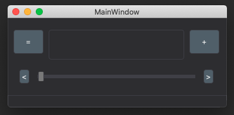

# SimpleMusicPlayer



A dull, but simple and easy music player.

Select a directory by click '+' button, then simply playing music.

It's directory-based. So you can play any music as long as you can get its `.mp3` file.

## Requirements

- support for CXX 14 (haven't tested on Windows)
- Git
- Qt6
- CMake >= 3.15.7

## Install

```
git clone https://github.com/DavidXu-JJ/SimpleMusicPlayer.git
cd SimpleMusicPlayer
cmake -B build
cd build
make
```

The binary executable will be located at `${your_path}/SimpleMusicPlayer/bin`

## Misc

Sometimes, I was forced to download multiple music app, because of the copyright of any particular song can be owned by any platform.

That's the reason why I create this directory-based music player.

